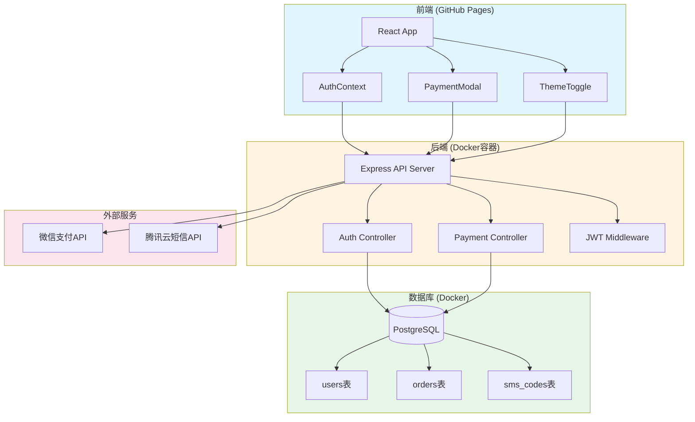
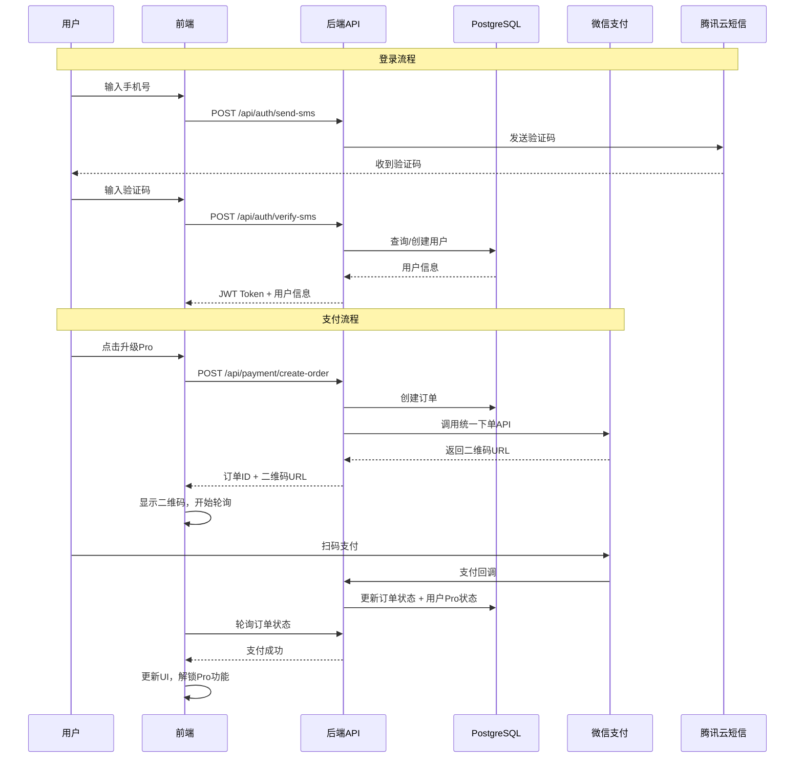

# 02-技术架构

## 系统架构图

```mermaid
graph TB
    subgraph Frontend["前端 (GitHub Pages)"]
        A[React App]
        B[AuthContext]
        C[PaymentModal]
        D[ThemeToggle]
    end
    
    subgraph Backend["后端 (Docker容器)"]
        E[Express API Server]
        F[Auth Controller]
        G[Payment Controller]
        H[JWT Middleware]
    end
    
    subgraph Database["数据库 (Docker)"]
        I[(PostgreSQL)]
        J[users表]
        K[orders表]
        L[sms_codes表]
    end
    
    subgraph External["外部服务"]
        M[微信支付API]
        N[腾讯云短信API]
    end
    
    A --> B
    A --> C
    A --> D
    B --> E
    C --> E
    D --> E
    E --> F
    E --> G
    E --> H
    F --> I
    G --> I
    I --> J
    I --> K
    I --> L
    E --> M
    E --> N
    
    style Frontend fill:#e1f5ff
    style Backend fill:#fff4e1
    style Database fill:#e8f5e9
    style External fill:#fce4ec
```

## 数据流向图

```mermaid
sequenceDiagram
    participant User as 用户
    participant Frontend as 前端
    participant Backend as 后端API
    participant DB as PostgreSQL
    participant WeChat as 微信支付
    participant SMS as 腾讯云短信
    
    Note over User,SMS: 登录流程
    User->>Frontend: 输入手机号
    Frontend->>Backend: POST /api/auth/send-sms
    Backend->>SMS: 发送验证码
    SMS-->>User: 收到验证码
    User->>Frontend: 输入验证码
    Frontend->>Backend: POST /api/auth/verify-sms
    Backend->>DB: 查询/创建用户
    DB-->>Backend: 用户信息
    Backend-->>Frontend: JWT Token + 用户信息
    
    Note over User,WeChat: 支付流程
    User->>Frontend: 点击升级Pro
    Frontend->>Backend: POST /api/payment/create-order
    Backend->>DB: 创建订单
    Backend->>WeChat: 调用统一下单API
    WeChat-->>Backend: 返回二维码URL
    Backend-->>Frontend: 订单ID + 二维码URL
    Frontend->>Frontend: 显示二维码，开始轮询
    User->>WeChat: 扫码支付
    WeChat->>Backend: 支付回调
    Backend->>DB: 更新订单状态 + 用户Pro状态
    Frontend->>Backend: 轮询订单状态
    Backend-->>Frontend: 支付成功
    Frontend->>Frontend: 更新UI，解锁Pro功能
```

---

**相关文档**:
- [01-项目概述](./01-项目概述.md)
- [03-系统流程](./03-系统流程.md)
- [04-数据库设计](./04-数据库设计.md)
- [返回目录](./00-目录.md)
