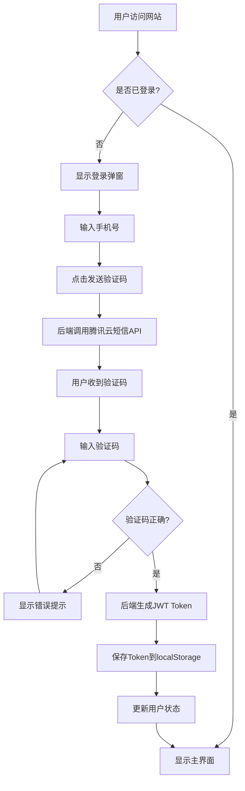
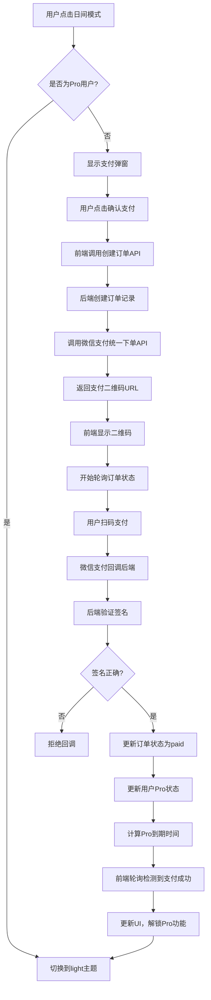
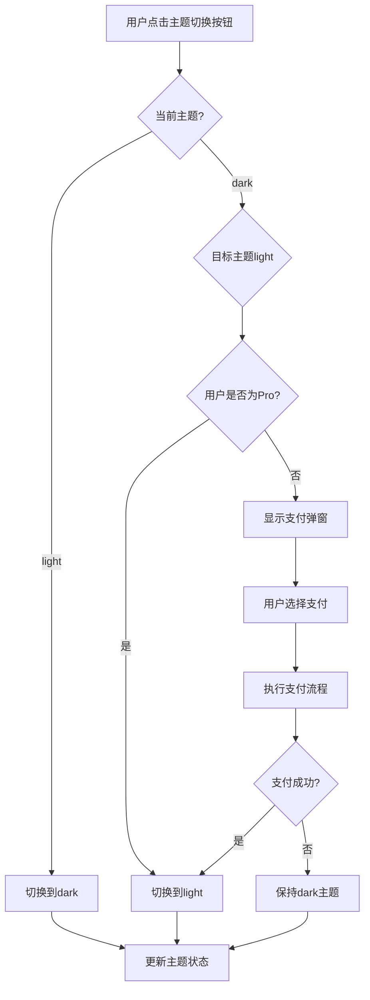

# 03-系统流程

## 用户登录流程

```mermaid
flowchart TD
    A[用户访问网站] --> B{是否已登录?}
    B -->|是| C[显示主界面]
    B -->|否| D[显示登录弹窗]
    D --> E[输入手机号]
    E --> F[点击发送验证码]
    F --> G[后端调用腾讯云短信API]
    G --> H[用户收到验证码]
    H --> I[输入验证码]
    I --> J{验证码正确?}
    J -->|否| K[显示错误提示]
    K --> I
    J -->|是| L[后端生成JWT Token]
    L --> M[保存Token到localStorage]
    M --> N[更新用户状态]
    N --> C
```

## 支付流程

```mermaid
flowchart TD
    A[用户点击日间模式] --> B{是否为Pro用户?}
    B -->|是| C[切换到light主题]
    B -->|否| D[显示支付弹窗]
    D --> E[用户点击确认支付]
    E --> F[前端调用创建订单API]
    F --> G[后端创建订单记录]
    G --> H[调用微信支付统一下单API]
    H --> I[返回支付二维码URL]
    I --> J[前端显示二维码]
    J --> K[开始轮询订单状态]
    K --> L[用户扫码支付]
    L --> M[微信支付回调后端]
    M --> N[后端验证签名]
    N --> O{签名正确?}
    O -->|否| P[拒绝回调]
    O -->|是| Q[更新订单状态为paid]
    Q --> R[更新用户Pro状态]
    R --> S[计算Pro到期时间]
    S --> T[前端轮询检测到支付成功]
    T --> U[更新UI，解锁Pro功能]
    U --> C
```

## 主题切换权限控制流程

```mermaid
flowchart TD
    A[用户点击主题切换按钮] --> B{当前主题?}
    B -->|dark| C{目标主题light}
    B -->|light| D[切换到dark]
    C --> E{用户是否为Pro?}
    E -->|是| F[切换到light]
    E -->|否| G[显示支付弹窗]
    G --> H[用户选择支付]
    H --> I[执行支付流程]
    I --> J{支付成功?}
    J -->|是| F
    J -->|否| K[保持dark主题]
    D --> L[更新主题状态]
    F --> L
    K --> L
```

---

**相关文档**:
- [02-技术架构](./02-技术架构.md)
- [04-数据库设计](./04-数据库设计.md)
- [05-API接口文档](./05-API接口文档.md)
- [返回目录](./00-目录.md)
