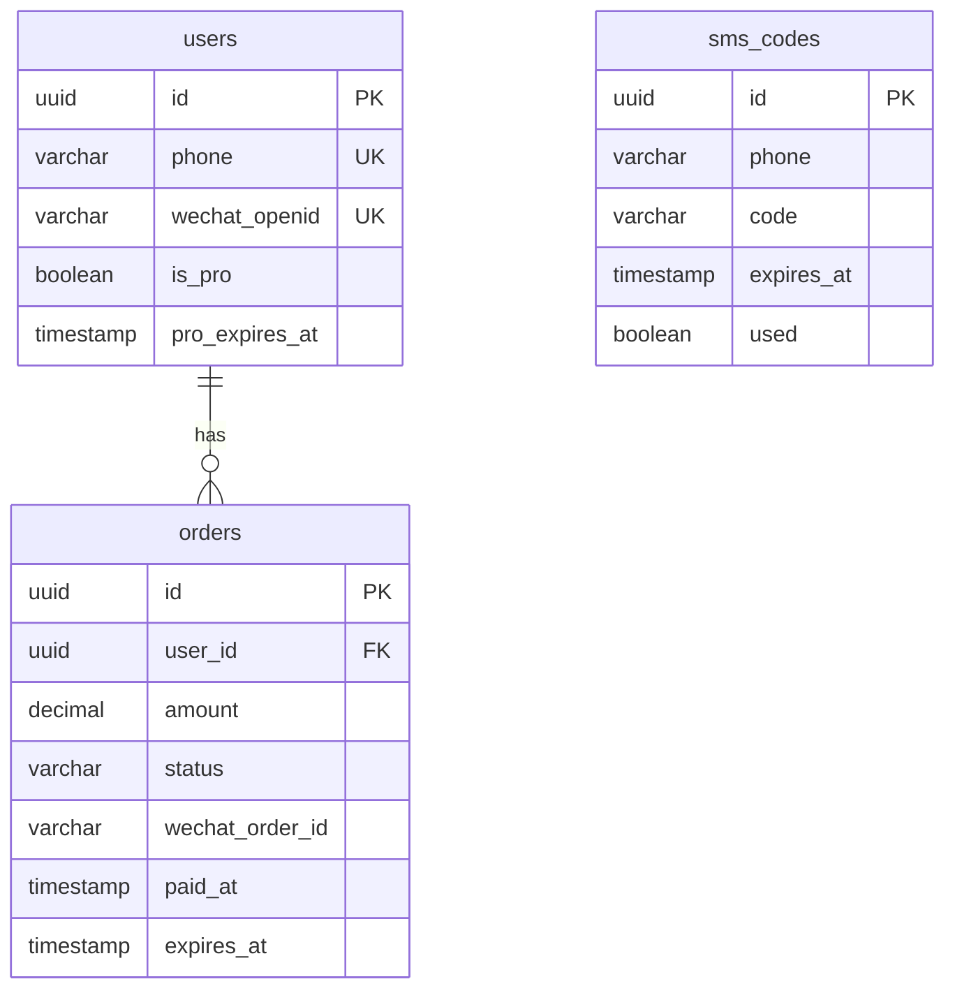

# 04-数据库设计

## 表结构设计

### 1. 用户表 (users)

```sql
CREATE TABLE users (
  id UUID PRIMARY KEY DEFAULT gen_random_uuid(),
  phone VARCHAR(11) UNIQUE NOT NULL,
  wechat_openid VARCHAR(128) UNIQUE,
  password_hash VARCHAR(255), -- 预留，未来可能支持密码登录
  is_pro BOOLEAN DEFAULT FALSE NOT NULL,
  pro_expires_at TIMESTAMP,
  created_at TIMESTAMP DEFAULT NOW() NOT NULL,
  updated_at TIMESTAMP DEFAULT NOW() NOT NULL
);

-- 索引
CREATE INDEX idx_users_phone ON users(phone);
CREATE INDEX idx_users_wechat_openid ON users(wechat_openid);
CREATE INDEX idx_users_is_pro ON users(is_pro);
CREATE INDEX idx_users_pro_expires_at ON users(pro_expires_at);

-- 更新时间触发器
CREATE OR REPLACE FUNCTION update_updated_at_column()
RETURNS TRIGGER AS $$
BEGIN
    NEW.updated_at = NOW();
    RETURN NEW;
END;
$$ language 'plpgsql';

CREATE TRIGGER update_users_updated_at BEFORE UPDATE ON users
    FOR EACH ROW EXECUTE FUNCTION update_updated_at_column();
```

**字段说明**:
- `id`: 用户唯一标识（UUID）
- `phone`: 手机号（唯一，用于登录）
- `wechat_openid`: 微信OpenID（预留，用于微信登录）
- `password_hash`: 密码哈希（预留）
- `is_pro`: 是否为Pro用户
- `pro_expires_at`: Pro到期时间（NULL表示永久或未开通）
- `created_at`: 创建时间
- `updated_at`: 更新时间

### 2. 订单表 (orders)

```sql
CREATE TABLE orders (
  id UUID PRIMARY KEY DEFAULT gen_random_uuid(),
  user_id UUID NOT NULL REFERENCES users(id) ON DELETE CASCADE,
  amount DECIMAL(10,2) NOT NULL, -- 金额（元）
  status VARCHAR(20) DEFAULT 'pending' NOT NULL, -- pending, paid, failed, refunded
  payment_method VARCHAR(20) DEFAULT 'wechat' NOT NULL,
  wechat_order_id VARCHAR(64), -- 微信支付订单号（商户订单号）
  wechat_transaction_id VARCHAR(64), -- 微信支付交易号
  wechat_prepay_id VARCHAR(64), -- 微信支付预支付交易会话ID
  created_at TIMESTAMP DEFAULT NOW() NOT NULL,
  paid_at TIMESTAMP,
  expires_at TIMESTAMP, -- Pro到期时间
  CONSTRAINT chk_status CHECK (status IN ('pending', 'paid', 'failed', 'refunded'))
);

-- 索引
CREATE INDEX idx_orders_user_id ON orders(user_id);
CREATE INDEX idx_orders_status ON orders(status);
CREATE INDEX idx_orders_wechat_order_id ON orders(wechat_order_id);
CREATE INDEX idx_orders_created_at ON orders(created_at);
```

**字段说明**:
- `id`: 订单唯一标识
- `user_id`: 用户ID（外键）
- `amount`: 订单金额（10.00元）
- `status`: 订单状态
- `payment_method`: 支付方式（目前只有wechat）
- `wechat_order_id`: 微信商户订单号
- `wechat_transaction_id`: 微信支付交易号
- `wechat_prepay_id`: 微信预支付ID
- `created_at`: 创建时间
- `paid_at`: 支付时间
- `expires_at`: Pro到期时间

### 3. 短信验证码表 (sms_codes)

```sql
CREATE TABLE sms_codes (
  id UUID PRIMARY KEY DEFAULT gen_random_uuid(),
  phone VARCHAR(11) NOT NULL,
  code VARCHAR(6) NOT NULL,
  expires_at TIMESTAMP NOT NULL,
  used BOOLEAN DEFAULT FALSE NOT NULL,
  created_at TIMESTAMP DEFAULT NOW() NOT NULL
);

-- 索引
CREATE INDEX idx_sms_codes_phone ON sms_codes(phone);
CREATE INDEX idx_sms_codes_expires_at ON sms_codes(expires_at);
CREATE INDEX idx_sms_codes_phone_used ON sms_codes(phone, used);

-- 自动清理过期验证码（通过定时任务或应用层逻辑）
```

**字段说明**:
- `id`: 验证码记录ID
- `phone`: 手机号
- `code`: 验证码（6位数字）
- `expires_at`: 过期时间（通常5-10分钟）
- `used`: 是否已使用
- `created_at`: 创建时间

## 数据库关系图



---

**相关文档**:
- [03-系统流程](./03-系统流程.md)
- [05-API接口文档](./05-API接口文档.md)
- [07-后端实现](./07-后端实现.md)
- [返回目录](./00-目录.md)
