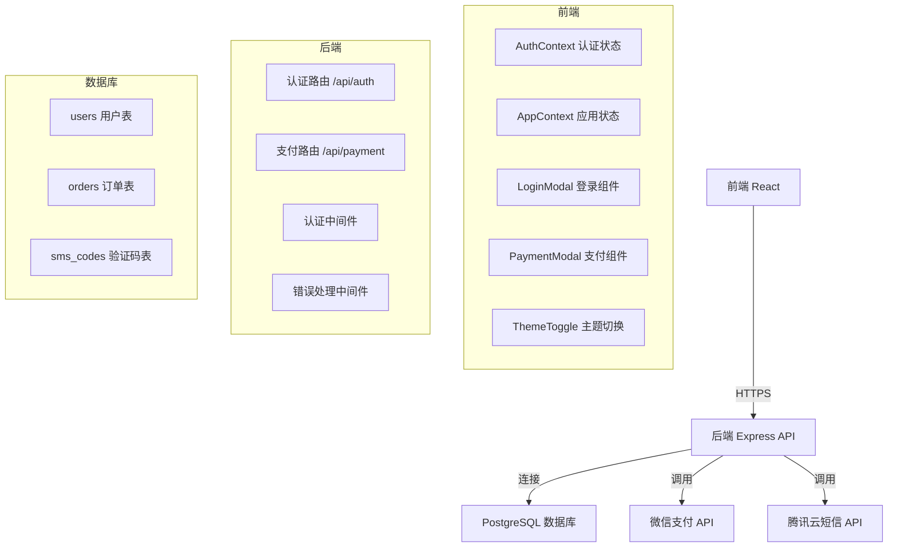
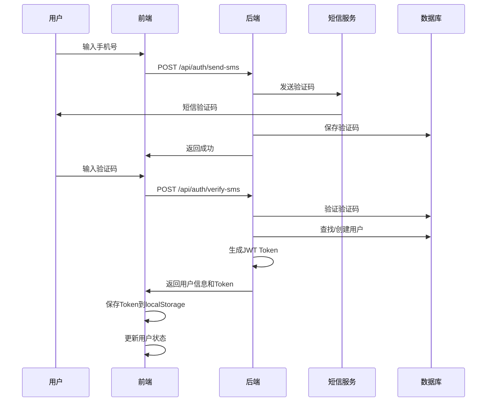
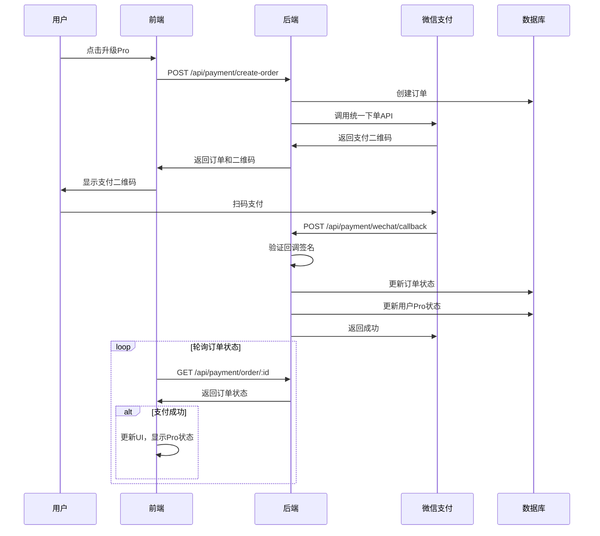
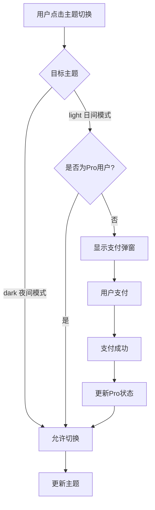
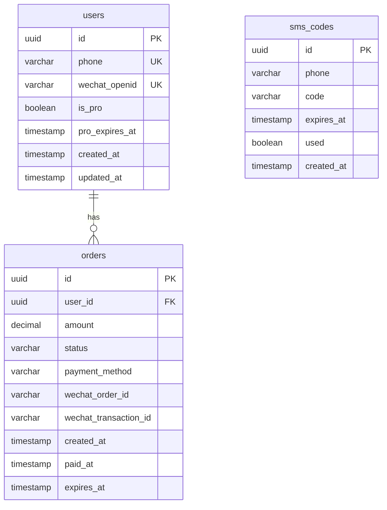

# 账号系统与付费系统完整文档

## 项目概述

本项目为AI聊天应用集成了完整的账号系统和付费订阅系统。用户可以通过手机号验证码登录，订阅Pro功能（10元/月）以使用日间模式等高级功能。

## 目录

- [技术架构](#技术架构)
- [系统流程图](#系统流程图)
- [数据库设计](#数据库设计)
- [API接口文档](#api接口文档)
- [前端组件说明](#前端组件说明)
- [部署指南](#部署指南)
- [开发指南](#开发指南)

## 技术架构

### 架构图



### 技术栈

#### 后端
- **运行时**: Node.js 18+
- **框架**: Express.js
- **语言**: TypeScript
- **数据库**: PostgreSQL 15
- **ORM**: 原生SQL（pg库）
- **认证**: JWT (jsonwebtoken)
- **支付**: 微信支付 Native支付
- **短信**: 腾讯云短信服务
- **容器化**: Docker + Docker Compose

#### 前端
- **框架**: React 18
- **语言**: TypeScript
- **构建工具**: Vite
- **状态管理**: Context API
- **HTTP客户端**: Fetch API
- **UI框架**: Tailwind CSS
- **图标**: react-icons

## 系统流程图

### 用户登录流程



### 支付流程



### 主题切换流程



## 数据库设计

### ER图



### 表结构详情

#### users 用户表
```sql
CREATE TABLE users (
  id UUID PRIMARY KEY DEFAULT gen_random_uuid(),
  phone VARCHAR(11) UNIQUE,
  wechat_openid VARCHAR(128) UNIQUE,
  password_hash VARCHAR(255),
  is_pro BOOLEAN DEFAULT FALSE,
  pro_expires_at TIMESTAMP,
  created_at TIMESTAMP DEFAULT NOW(),
  updated_at TIMESTAMP DEFAULT NOW()
);
```

**索引**:
- `idx_users_phone` ON `phone`
- `idx_users_wechat_openid` ON `wechat_openid`

#### orders 订单表
```sql
CREATE TABLE orders (
  id UUID PRIMARY KEY DEFAULT gen_random_uuid(),
  user_id UUID REFERENCES users(id) ON DELETE CASCADE,
  amount DECIMAL(10,2) NOT NULL,
  status VARCHAR(20) DEFAULT 'pending',
  payment_method VARCHAR(20) DEFAULT 'wechat',
  wechat_order_id VARCHAR(64),
  wechat_transaction_id VARCHAR(64),
  created_at TIMESTAMP DEFAULT NOW(),
  paid_at TIMESTAMP,
  expires_at TIMESTAMP,
  updated_at TIMESTAMP DEFAULT NOW()
);
```

**索引**:
- `idx_orders_user_id` ON `user_id`
- `idx_orders_status` ON `status`
- `idx_orders_wechat_order_id` ON `wechat_order_id`

#### sms_codes 短信验证码表
```sql
CREATE TABLE sms_codes (
  id UUID PRIMARY KEY DEFAULT gen_random_uuid(),
  phone VARCHAR(11) NOT NULL,
  code VARCHAR(6) NOT NULL,
  expires_at TIMESTAMP NOT NULL,
  used BOOLEAN DEFAULT FALSE,
  created_at TIMESTAMP DEFAULT NOW()
);
```

**索引**:
- `idx_sms_codes_phone` ON `phone`
- `idx_sms_codes_expires` ON `expires_at`

## API接口文档

### 基础信息

- **Base URL**: `https://your-domain.com/api`
- **认证方式**: Bearer Token (JWT)
- **Content-Type**: `application/json`

### 认证接口

#### 1. 发送验证码

**请求**:
```http
POST /api/auth/send-sms
Content-Type: application/json

{
  "phone": "13800138000"
}
```

**响应**:
```json
{
  "success": true,
  "message": "验证码已发送"
}
```

**错误响应**:
```json
{
  "success": false,
  "message": "验证码发送过于频繁，请稍后再试"
}
```

#### 2. 验证码登录/注册

**请求**:
```http
POST /api/auth/verify-sms
Content-Type: application/json

{
  "phone": "13800138000",
  "code": "123456"
}
```

**响应**:
```json
{
  "success": true,
  "message": "登录成功",
  "data": {
    "user": {
      "id": "550e8400-e29b-41d4-a716-446655440000",
      "phone": "13800138000",
      "isPro": false,
      "proExpiresAt": null
    },
    "token": "eyJhbGciOiJIUzI1NiIsInR5cCI6IkpXVCJ9..."
  }
}
```

**错误响应**:
```json
{
  "success": false,
  "message": "验证码无效或已过期"
}
```

#### 3. 获取当前用户信息

**请求**:
```http
GET /api/auth/me
Authorization: Bearer <token>
```

**响应**:
```json
{
  "success": true,
  "data": {
    "id": "550e8400-e29b-41d4-a716-446655440000",
    "phone": "13800138000",
    "isPro": true,
    "proExpiresAt": "2024-02-01T00:00:00Z",
    "createdAt": "2024-01-01T00:00:00Z"
  }
}
```

#### 4. 刷新Token

**请求**:
```http
POST /api/auth/refresh
Authorization: Bearer <token>
```

**响应**:
```json
{
  "success": true,
  "data": {
    "token": "eyJhbGciOiJIUzI1NiIsInR5cCI6IkpXVCJ9..."
  }
}
```

### 支付接口

#### 1. 创建支付订单

**请求**:
```http
POST /api/payment/create-order
Authorization: Bearer <token>
```

**响应**:
```json
{
  "success": true,
  "message": "订单创建成功",
  "data": {
    "orderId": "550e8400-e29b-41d4-a716-446655440000",
    "qrCode": "weixin://wxpay/bizpayurl?pr=xxx",
    "amount": 10.00
  }
}
```

#### 2. 查询订单状态

**请求**:
```http
GET /api/payment/order/:orderId
Authorization: Bearer <token>
```

**响应**:
```json
{
  "success": true,
  "data": {
    "id": "550e8400-e29b-41d4-a716-446655440000",
    "amount": 10.00,
    "status": "paid",
    "createdAt": "2024-01-01T00:00:00Z",
    "paidAt": "2024-01-01T00:00:01Z",
    "expiresAt": "2024-02-01T00:00:00Z"
  }
}
```

**订单状态**:
- `pending`: 待支付
- `paid`: 已支付
- `failed`: 支付失败
- `refunded`: 已退款

#### 3. 查询订阅状态

**请求**:
```http
GET /api/payment/subscription
Authorization: Bearer <token>
```

**响应**:
```json
{
  "success": true,
  "data": {
    "isPro": true,
    "expiresAt": "2024-02-01T00:00:00Z"
  }
}
```

#### 4. 微信支付回调

**请求**:
```http
POST /api/payment/wechat/callback
Content-Type: application/xml

<xml>
  <appid>wx1234567890</appid>
  <mch_id>1234567890</mch_id>
  <out_trade_no>ORDER_xxx</out_trade_no>
  <transaction_id>4200001234567890</transaction_id>
  <result_code>SUCCESS</result_code>
  ...
</xml>
```

**响应**:
```xml
<xml>
  <return_code><![CDATA[SUCCESS]]></return_code>
</xml>
```

## 前端组件说明

### AuthContext

认证状态管理上下文，提供登录、登出、用户信息等功能。

**使用示例**:
```typescript
import { useAuth } from './contexts/AuthContext';

function MyComponent() {
  const { user, isAuthenticated, login, logout } = useAuth();
  
  // ...
}
```

### LoginModal

登录弹窗组件，支持手机号验证码登录。

**Props**:
- `isOpen: boolean` - 是否显示
- `onClose: () => void` - 关闭回调

### PaymentModal

支付弹窗组件，显示支付二维码并轮询订单状态。

**Props**:
- `isOpen: boolean` - 是否显示
- `onClose: () => void` - 关闭回调

### ThemeToggle

主题切换组件，自动检查Pro状态，非Pro用户切换到日间模式时显示支付弹窗。

## 部署指南

### 1. 服务器准备

- 购买腾讯云CVM服务器（推荐2核4G）
- 配置安全组，开放80、443、3000端口
- 申请域名并配置DNS解析

### 2. 安装Docker

```bash
# 安装Docker
curl -fsSL https://get.docker.com | bash

# 安装Docker Compose
sudo curl -L "https://github.com/docker/compose/releases/download/v2.20.0/docker-compose-$(uname -s)-$(uname -m)" -o /usr/local/bin/docker-compose
sudo chmod +x /usr/local/bin/docker-compose
```

### 3. 配置SSL证书

使用Let's Encrypt免费证书：
```bash
sudo apt install certbot
sudo certbot certonly --standalone -d your-domain.com
```

### 4. 配置Nginx

创建 `/etc/nginx/sites-available/chat-app`:
```nginx
server {
    listen 80;
    server_name your-domain.com;
    return 301 https://$server_name$request_uri;
}

server {
    listen 443 ssl http2;
    server_name your-domain.com;
    
    ssl_certificate /etc/letsencrypt/live/your-domain.com/fullchain.pem;
    ssl_certificate_key /etc/letsencrypt/live/your-domain.com/privkey.pem;
    
    location / {
        proxy_pass http://localhost:3000;
        proxy_set_header Host $host;
        proxy_set_header X-Real-IP $remote_addr;
        proxy_set_header X-Forwarded-For $proxy_add_x_forwarded_for;
        proxy_set_header X-Forwarded-Proto $scheme;
    }
}
```

启用配置：
```bash
sudo ln -s /etc/nginx/sites-available/chat-app /etc/nginx/sites-enabled/
sudo nginx -t
sudo systemctl reload nginx
```

### 5. 部署后端服务

```bash
# 克隆代码
git clone <repository>
cd backend

# 配置环境变量
cp .env.example .env
# 编辑 .env 文件，填写配置

# 启动服务
cd docker
docker-compose up -d

# 运行数据库迁移
docker-compose exec backend npm run migrate

# 查看日志
docker-compose logs -f
```

### 6. 配置前端API地址

在前端项目中创建 `.env` 文件：
```env
VITE_API_BASE_URL=https://your-domain.com
```

## 开发指南

### 本地开发

#### 后端开发

```bash
cd backend

# 安装依赖
npm install

# 启动PostgreSQL（使用Docker）
docker run -d --name postgres \
  -e POSTGRES_USER=user \
  -e POSTGRES_PASSWORD=password \
  -e POSTGRES_DB=chat_app \
  -p 5432:5432 \
  postgres:15-alpine

# 运行数据库迁移
npm run migrate

# 启动开发服务器
npm run dev
```

#### 前端开发

```bash
# 安装依赖
npm install

# 配置API地址
echo "VITE_API_BASE_URL=http://localhost:3000" > .env

# 启动开发服务器
npm run dev
```

### 代码结构

#### 后端结构
```
backend/
├── src/
│   ├── config/          # 配置文件
│   ├── controllers/     # 控制器
│   ├── services/        # 业务逻辑
│   ├── models/          # 数据模型
│   ├── middleware/      # 中间件
│   ├── routes/          # 路由
│   ├── utils/           # 工具函数
│   └── app.ts           # 应用入口
├── migrations/          # 数据库迁移
├── docker/              # Docker配置
└── package.json
```

#### 前端结构
```
src/
├── contexts/            # Context状态管理
├── components/          # React组件
├── services/           # API服务
├── utils/              # 工具函数
├── types/              # TypeScript类型
└── hooks/              # 自定义Hooks
```

## 安全最佳实践

1. **JWT Token安全**
   - 使用强随机密钥
   - 设置合理的过期时间（7天）
   - 考虑实现Token刷新机制

2. **支付安全**
   - 验证微信支付回调签名
   - 防止重复处理回调
   - 订单状态幂等性检查

3. **数据库安全**
   - 使用参数化查询
   - 定期备份数据库
   - 限制数据库访问IP

4. **API安全**
   - 配置CORS白名单
   - 实现请求频率限制
   - 输入验证和清理

5. **环境变量安全**
   - 不要提交 `.env` 文件
   - 使用密钥管理服务
   - 定期轮换密钥

## 监控和日志

### 日志记录

后端使用 `console.log` 记录日志，生产环境建议使用专业的日志服务：
- Winston
- Pino
- 腾讯云CLS

### 监控指标

建议监控以下指标：
- API响应时间
- 错误率
- 数据库连接数
- 支付成功率
- 用户活跃度

## 故障排查

### 常见问题

1. **数据库连接失败**
   - 检查数据库服务是否运行
   - 验证连接字符串配置
   - 检查防火墙规则

2. **支付回调失败**
   - 检查回调URL是否可访问
   - 验证签名算法
   - 查看回调日志

3. **短信发送失败**
   - 检查腾讯云配置
   - 验证短信模板
   - 查看账户余额

## 后续优化

1. **功能扩展**
   - 微信登录集成
   - 对话数据云端同步
   - 订阅管理页面
   - 邮件通知

2. **性能优化**
   - Redis缓存
   - 数据库读写分离
   - CDN加速

3. **运维优化**
   - CI/CD自动化部署
   - 容器编排（Kubernetes）
   - 监控告警系统

## 许可证

MIT
